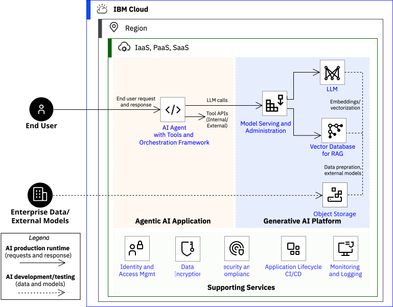
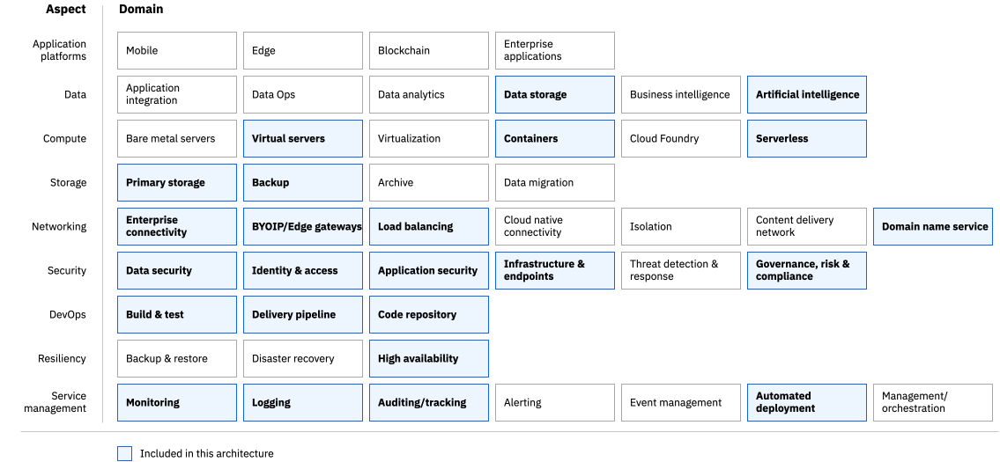

---

# The YAML header is required. For more information about the YAML header, see
# https://test.cloud.ibm.com/docs-internal/writing?topic=writing-reference-architectures

copyright:
  years: 2023
lastupdated: "2025-05-09"

keywords: # Not typically populated

subcollection: pattern-agentic-ai # Use deployable-reference-architectures, or the subcollection value from your toc.yaml file if docs-only.

authors:
  - name: Anuj Jain

# The release that the reference architecture describes
version: 1.0

# Use if the reference architecture has deployable code.
# Value is the URL to land the user in the IBM Cloud catalog details page for the deployable architecture.
# See https://test.cloud.ibm.com/docs/get-coding?topic=get-coding-deploy-button
deployment-url: url

docs: https://cloud.ibm.com/docs/solution-guide

# use-case from 'code' column in
# https://github.ibm.com/digital/taxonomy/blob/main/topics/topics_flat_list.csv
use-case:
  - AIForCustomerService
  - AIGovernance
  - BankingAndFinanceIndustry
  - AIInfrastructureandServers
  - AIPrivacyAndSecurity

# industry from 'code' column in
# https://github.ibm.com/digital/taxonomy/blob/main/industries/industries_flat_list.csv
industry: Banking, FinancialSector, Insurance

# compliance from 'code' column in
# https://github.ibm.com/digital/taxonomy/blob/main/compliance_entities/compliance_entities_flat_list.csv
compliance:

content-type: reference-architecture

# For reference architectures in https://github.com/terraform-ibm-modules only.
# All reference architectures stored in the /reference-architectures directory

# Set production to true to publish the reference architecture to IBM Cloud docs.

production: false

---

{{site.data.keyword.attribute-definition-list}}

# Agentic AI patterns on IBM Cloud
{: #agenticai-pattern}
{: toc-content-type="reference-architecture"}
{: toc-version="1.0"}

This reference architecture summarizes the best practices for deploying agentic artificial intelligence (AI) patterns on IBM Cloud. 

[Agentic AI](https://www.ibm.com/think/topics/agentic-ai) is rapidly enabling a new paradigm for organizations to improve their products, services, and business processes. Understanding agentic AI and its dependencies is vital for navigating its complex landscape. Agentic AI systems require not just the AI and generative AI capabilities but also rely on various other supporting services that provide the ecosystem for development and operations. 

###### Logical architecture and key components
The figure below shows the logical architecture and key components of a typical agentic AI system on IBM Cloud. 

{: caption="Agentic AI system showing logical architecture and key components." caption-side="bottom"}

To perform its function, each logical layer is enabled by a set of SaaS, PaaS or IaaS cloud service options. SaaS services are multi-tenant, i.e, they logically separate deployments from different oganizations but physically share the underlying infrastructure environment that is managed by IBM Cloud. SaaS is well-suited for convenience, initial experimentation, PoCs and for simple to medium complexity deployments in production. IaaS and PaaS services provide single-tenant dedicated isolated infrastructure for deployments with varying degree of control and management responsibilities for the organization. 

Below is a description about the logical layers, their key components and the typical SaaS, PaaS or IaaS cloud services to enable their function.

- **Agentic AI application**: This includes the core agentic AI system of AI agent/s with their tools, and the orchestration framework to service the end-user requests using LLMs. This may also include the applications that are required for end-user interaction with the agentic AI system (e.g. the user interface, chat interface, smartphone apps etc.) and the backend systems that provide the enterprise’s business logic and data to the agentic AI system (e.g., microservices, internal API etc.).

  It is often cost effective to use multi-tenant (PaaS) services like serverless Code Engine for hosting applications, including the core agentic AI application. For complex applications and backend microservices, VPC based virtual server instances or Red Hat OpenShift cluster provide a single-tenant dedicated alternative. These applications typically do not require GPUs.

- **Generative AI platform**: This includes the foundational platform that provides the LLM services. It brings together the GPUs and models to provide model serving for inferencing. It includes an ecosystem of UI/APIs or services that enable prompt and fine tuning of models, iterative testing and validation, model management, scaling, vector stores for retrieval augmented generation (RAG) etc.

  A fundamental architectural decision is about the organization's level of access and control over GPUs for generative AI tasks like inferencing, and fine tuning. IBM Cloud watsonx.ai SaaS service has a shared multi-tenant infrastructure and GPUs shared across organizations' workloads. IBM Cloud IaaS and PaaS services that include options from virtual servers, Red Hat AI and watsonx.ai software provide dedicated single-tenant infrastructure and control over GPUs.
  
- **Supporting services**: This includes the ecosystem of supporting services for overall security, compliance, secure devops application lifecycle and services that enable routine operational management for the agentic AI system and its dependencies.
    These services are available as multi-tenant SaaS services on IBM Cloud.

Based on above considerations and the enabling IaaS, PaaS, SaaS service combinations, multiple architectural patterns for deploying an agentic AI system are possible.

###### Common architectural patterns
The common architectural patterns for agentic AI on IBM Cloud include:

- **Pattern 1: Minimal - Shared GPUs**: Refer to this for getting started with agentic AI, basic experimentation, development, PoCs etc.
- **Pattern 2: Small/Medium - Shared GPUs**: Refer to this for small/medium size production agentic AI workloads, where the organization wants convenience and does not want deep control over generative AI infrastructure and platform.
- **Pattern 3: Medium/Large - Dedicated GPUs**: Refer to this for medium/large production agentic AI workloads, where the organization wants deeper control over generative AI infrastructure, GPUs and platform.

Reference architectures for these patterns are described below.

## Architecture diagram
{: #architecture-diagram}

The reference architectures below show how IBM Cloud provides a secure, compliant and resilient environment to implement an agentic AI system. 

### Pattern 1: Minimal - Shared GPUs

This architecture uses minimal shared multi-tenant PaaS and SaaS services from IBM Cloud for deploying applications and utilizing generative AI platform GPUs. For the purpose of trial/PoCs, the enhanced security, compliance, logging, monitoring services are not required and not included in the architecture.

{: caption="Agentic AI reference architecture for Pattern 1: Minimal - Shared GPUs." caption-side="bottom"}

Below is a description about the deployment of workloads and their administration.

**Management and Administration** 
IBM Cloud Identity and Access Management services.

**Application Workload** 
Serverless platform like Code Engine for hosting these applications, backend services and IBM Cloud databases. 

**Agentic AI Application Workload** 
Serverless platform like Code Engine and other IBM Cloud platforms and services like watsonx.ai and watsonx Orchestrate that provide low-code / no-code alternatives to create and host agentic AI systems. 

**Generative AI Platform** 
Generative AI capabilities and shared GPUs are available from watsonx.ai SaaS service.

**Edge Compute and Network** 
PaaS and SaaS services provide their own security and access controls for the hosted applications and services.

Here are some references to get started with this pattern:

- [Code Engine - Getting started](https://cloud.ibm.com/docs/codeengine?topic=codeengine-getting-started#app-hello) 
- [watsonx.ai - Getting started](https://www.ibm.com/docs/en/watsonx/saas?topic=getting-started-tutorials)
- [watsonx Orchestrate - Getting started](https://www.ibm.com/docs/en/watsonx/watson-orchestrate/current?topic=getting-started-watsonx-orchestrate)

### Pattern 2: Small/Medium - Shared GPUs

This architecture uses shared multi-tenant PaaS and SaaS services from IBM Cloud for deploying applications and utilizing generative AI platform GPUs. Security, compliance, logging, monitoring and application lifecycle (DevSecOps) are common and required services available as SaaS on IBM Cloud. 

{: caption="Agentic AI reference architecture for Pattern 2: Small/Medium - Shared GPUs." caption-side="bottom"}

Below is a description about the deployment of workloads and their administration.

**Management and Administration** 
IBM Cloud Identity and Access Management services.

**Application Workload** 
Serverless platform like Code Engine for hosting these applications, backend services and IBM Cloud databases. 

**Agentic AI Application Workload** 
Serverless platform like Code Engine and other IBM Cloud platforms and services like watsonx.ai and watsonx Orchestrate that provide low-code / no-code alternatives to create and host agentic AI systems. 

**Generative AI Platform** 
Generative AI capabilities and shared GPUs are available from watsonx.ai SaaS service.

**Edge Compute and Network** 
PaaS and SaaS services provide their own security and access controls for the hosted applications and services.

In this pattern [Deployable Architectures](https://cloud.ibm.com/docs/secure-enterprise?topic=secure-enterprise-understand-module-da#what-is-da) can be utilized for automating the provisioning and deployment of services. Here are some references.

- [DevSecOps Application Lifecycle Management – Deployable Architecture](https://cloud.ibm.com/docs/devsecops-alm?topic=devsecops-alm-deploy-arch-ibm-devsecops-alm)
- [Security and Observability Services – Deployable Architecture](https://cloud.ibm.com/docs/security-hub?topic=security-hub-core-security-services-pattern)
- [Retrieval Augmented Generation - Deployable Architecture](https://cloud.ibm.com/catalog/7a4d68b4-cf8b-40cd-a3d1-f49aff526eb3/architecture/Retrieval_Augmented_Generation_Pattern-5fdd0045-30fc-4013-a8bc-6db9d5447a52-global)
- [Gen AI pattern for watsonx on IBM Cloud](https://cloud.ibm.com/docs/pattern-genai-rag?topic=pattern-genai-rag-genai-pattern)

### Pattern 3: Medium/Large - Dedicated GPUs

This architecture uses dedicated single-tenant deployments of applications and generative AI platform and utilizes virtual private clouds (VPCs) with IBM Cloud IaaS and PaaS services. It reuses the [best practices](https://cloud.ibm.com/docs/framework-financial-services?topic=framework-financial-services-about) for IBM Cloud for Financial Services and [VPC reference architecture](https://cloud.ibm.com/docs/framework-financial-services?topic=framework-financial-services-vpc-architecture-about).

Security, compliance, logging, monitoring and application lifecycle (DevSecOps) are common and required services available as SaaS on IBM Cloud. 

{: caption="Agentic AI reference architecture for Pattern 3: Medium/Large - Dedicated GPUs." caption-side="bottom"}

Below is a description about the deployment of workloads on VPCs and their administration.

**Management and Administration** 

The Management VPC provides compute, storage, and network services like VPN to enable the consumer's or service provider's administrators to monitor, operate, and maintain the deployed agentic AI environment infrastructure. IBM Cloud Identity and Access Management services provides controls for PaaS and SaaS services.

**Application Workload** 

The Application workload VPC provides the dedicated compute, storage, and network services to support the frontend / UI application that end-users use to access an agentic system. It also includes backend applications and business microservices that agentic AI application may require. These include the virtual server instance or Red Hat OpenShift for containerized workloads.

**Agentic AI Application Workload** 

The Agentic AI Application Workload VPC provides the dedicated compute, storage, and network services to support the core agentic AI application and their dependencies like the tools and orchestration frameworks. These include the virtual server instance or Red Hat OpenShift for containerized workloads.

**Generative AI Platform** 

The Gen AI Platform Workload VPC provides the dedicated compute, including GPUs, storage, and network services to securely support a generative AI platform of virtual server instances or containers. The options include:
- Virtual Server Instances (VSI) with GPUs
- Kubernetes cluster with GPU nodes
- Red Hat Enterprise Linux AI (RHELAI) VSI with GPU nodes
- Red Hat OpenShift cluster with GPU nodes 
- Red Hat OpenShift AI (RHOAI) cluster with GPU nodes
- Red Hat OpenShift cluster with GPU nodes + watsonx AI software

The available GPU profiles can be found [here](https://cloud.ibm.com/docs/vpc?topic=vpc-profiles&interface=ui#gpu).

**Edge Compute and Network** 

The edge VPC is used to enhance boundary protection. Consumers access agentic AI front-end/user interface applications in the workload VPCs from the public internet through edge VPC protections and load balancing. Transit Gateway provides connectivity to external or on-premises resources via Direct Link and also between VPCs.

This pattern includes deploying applications and platforms on VPCs. Here are some references.

- [VPC Landing zone - Deployable Architecture](https://cloud.ibm.com/docs/secure-infrastructure-vpc)
- [Red Hat Enterprise Linux AI - Deployable Architecture](https://cloud.ibm.com/catalog/7a4d68b4-cf8b-40cd-a3d1-f49aff526eb3/architecture/deploy-arch-ibm-rhel-ai-vsi-d85e5d60-cce5-45f4-bbbd-4bcc32c66abf-global)
- [Deploying microservices on Red Hat OpenShift](https://cloud.ibm.com/docs/solution-tutorials?topic=solution-tutorials-openshift-microservices)
- [Customer managed watsonx gen AI pattern](https://cloud.ibm.com/docs/pattern-customer-managed-watsonx-gen-ai)

## Design concepts
{: #design-concepts}

Below is the Architecture Framework Design heatmap that covers design considerations and architecture decisions for the following aspects and domains:
* **Data:** Artifical Intelligence
* **Compute:** Virtual Servers, Containers, Serverless
* **Storage:** Primary Storage, Backup
* **Networking:** Enterprise Connectivity, Load Balancing, Domain Name Services
* **Security:** Data Security, Identity & Access, Application Security, Infrastructure & Endpoints, Governance, Risk & Compliance
* **DevOps:** Build & Test, Delivery Pipeline, Code Repository
* **Resiliency:** High Availability
* **Service Management:** Monitoring, Logging, Auditing / tracking, Automated Deployment

{: caption="Architecture design scope" caption-side="bottom"}

## Requirements
{: #requirements}

The following table outlines the requirements that are addressed in this architecture.

| Aspect | Requirements |
| -------------- | -------------- |
| Compute            | Provide properly isolated compute resources with adequate compute capacity for the applications. |
| Storage            | Provide storage that meets the application and database performance requirements. |
| Networking         | Deploy workloads in isolated environment and enforce information flow policies. \n Provide secure, encrypted connectivity to the cloud’s private network for management purposes. \n Distribute incoming application requests across available compute resources. |
| Security           | Ensure all operator actions are executed securely through a bastion host. \n Protect the boundaries of the application against denial-of-service and application-layer attacks. \n Encrypt all application data in transit and at rest to protect from unauthorized disclosure. \n Encrypt all security data (operational and audit logs) to protect from unauthorized disclosure. \n Encrypt all data using customer managed keys to meet regulatory compliance requirements for additional security and customer control. \n Protect secrets through their entire lifecycle and secure them using access control measures. \n Firewalls must be restrictively configured to prevent all traffic, both inbound and outbound, except that which is required, documented, and approved. |
| DevOps            | Delivering software and services at the speed the market demands requires teams to iterate and experiment rapidly. They must deploy new versions frequently, driven by feedback and data. |
| Resiliency         | Support application availability targets and business continuity policies. \n Ensure availability of the application in the event of planned and unplanned outages. \n Backup application data to enable recovery in the event of unplanned outages. \n Provide highly available storage for security data (logs) and backup data. |
| Service Management | Monitor system and application health metrics and logs to detect issues that might impact the availability of the application. \n Generate alerts/notifications about issues that might impact the availability of applications to trigger appropriate responses to minimize down time. \n Monitor audit logs to track changes and detect potential security problems. \n Provide a mechanism to identify and send notifications about issues found in audit logs. |
{: caption="Requirements" caption-side="bottom"}

## Components
{: #components}

The following table outlines the products or services used in the architecture for each aspect.

| Aspects | Architecture components | How the component is used |
| -------------- | -------------- | -------------- |
| Data | [watsonx Orchestrate](https://www.ibm.com/products/watsonx-orchestrate) | Orchestrate AI agents, assistants and workflows across your business |
|  | [watsonx.ai](https://www.ibm.com/products/watsonx-ai) | Brings together new generative AI capabilities powered by foundation models and traditional machine learning (ML) into a powerful studio spanning the AI lifecycle |
|  | [watsonx.data with Milvus](https://www.ibm.com/products/watsonx-data) | Enables data analytics for AI at scale and provides Milvus database to store vector embeddings for RAG patterns |
|  | [watsonx.governance](https://www.ibm.com/products/watsonx-governance) | Direct, manage and monitor the artificial intelligence activities |
|  | [Elasticsearch](https://www.ibm.com/topics/elasticsearch) | Database to store vector embeddings for RAG patterns |
| Compute | [Virtual Servers for VPC](https://cloud.ibm.com/docs/vpc?topic=vpc-about-advanced-virtual-servers&interface=ui) | Web, App, and database servers |
| | [Code Engine](https://cloud.ibm.com/docs/codeengine?topic=codeengine-about) |  Abstracts the operational burden of building, deploying, and managing workloads in Kubernetes so that developers can focus on what matters most to them: the source code|
| | [Red Hat OpenShift Kubernetes Service (ROKS)](https://cloud.ibm.com/docs/openshift?topic=openshift-getting-started) | A managed offering to create your own cluster of compute hosts where you can deploy and manage containerized apps on IBM Cloud |
| Storage | [Cloud Object Storage](https://cloud.ibm.com/docs/cloud-object-storage?topic=cloud-object-storage-about-cloud-object-storage) | Web app static content, backups, logs (application, operational, and audit logs) |
|  | [VPC Block Storage](https://cloud.ibm.com/docs/openshift?topic=openshift-vpc-block) | Web app storage if needed |
| Networking | [VPC Virtual Private Network (VPN)](https://cloud.ibm.com/docs/iaas-vpn?topic=iaas-vpn-getting-started) | Remote access to manage resources in private network |
|  | [Virtual Private Endpoint (VPE)](https://cloud.ibm.com/docs/vpc?topic=vpc-about-vpe) | For private network access to Cloud Services, e.g., Key Protect, COS, etc. |
|  | [VPC Load Balancers](https://cloud.ibm.com/docs/vpc?topic=vpc-load-balancers) | Application Load Balancing for web servers, app servers, and database servers |
|  | [Direct Link 2.0](https://cloud.ibm.com/docs/dl?topic=dl-get-started-with-ibm-cloud-dl) | Seamlessly connect on-premises resources to cloud resources |
|  | [Transit Gateway (TGW)](https://cloud.ibm.com/docs/transit-gateway?topic=transit-gateway-getting-started) | Connects the Workload and Management VPCs within a region
|  | [Cloud Internet Services (CIS)](https://cloud.ibm.com/docs/cis?topic=cis-getting-started) | Global load balancing between regions |
|  | [Access Control List (ACL)](https://cloud.ibm.com/docs/vpc?topic=vpc-using-acls) | To control all incoming and outgoing traffic in Virtual Private Cloud |
| Security | [IAM](https://cloud.ibm.com/docs/account?topic=account-cloudaccess) | IBM Cloud Identity & Access Management |
|  | [Key Protect](https://cloud.ibm.com/docs/key-protect?topic=key-protect-about) | A full-service encryption solution that allows data to be secured and stored in IBM Cloud |
|  | [BYO Bastion Host on VPC VSI](https://cloud.ibm.com/docs/framework-financial-services?topic=framework-financial-services-vpc-architecture-connectivity-bastion-tutorial-teleport) | Remote access with Privileged Access Management |
|  | [App ID](https://cloud.ibm.com/docs/appid?topic=appid-getting-started) | Add authentication to web and mobile apps |
|  | [Secrets Manager](https://cloud.ibm.com/docs/secrets-manager?topic=secrets-manager-getting-started#getting-started) | Certificate and Secrets Management |
|  | [Security and Compliance Center (SCC)](https://cloud.ibm.com/docs/security-compliance?topic=security-compliance-getting-started) | Implement controls for secure data and workload deployments, and assess security and compliance posture |
|  | [Hyper Protect Crypto Services (HPCS)](https://cloud.ibm.com/docs/hs-crypto?topic=hs-crypto-get-started) | Hardware security module (HSM) and Key Management Service |
|  | [Virtual Network Function (VNF)](https://cloud.ibm.com/docs/vpc?topic=vpc-deploy-vnf) | Virtualized network services running on virtual machines. |
| DevOps | [Continuous Integration (CI)](https://cloud.ibm.com/docs/containers?topic=containers-cicd) | 	A pipeline that tests, scans and builds the deployable artifacts from the application repositories |
|  | [Continuous Deployment (CD)](https://cloud.ibm.com/docs/ContinuousDelivery?topic=ContinuousDelivery-getting-started) | A pipeline that generates all of the evidence and change request summary content |
|  | [Continuous Compliance (CC)](https://cloud.ibm.com/docs/devsecops?topic=devsecops-tutorial-cc-toolchain) | A pipeline that continuously scans deployed artifacts and repositories |
|  | [Container Registry](https://cloud.ibm.com/apidocs/container-registry) | Highly available, and scalable private image registry |
| Resiliency | 	[VPC VSIs, VPC Block across multiple zones in two regions](https://cloud.ibm.com/docs/solution-tutorials?topic=solution-tutorials-vpc-multi-region) | Web, app, database high availability and disaster recovery |
| Service Management | [Cloud Monitoring](https://cloud.ibm.com/docs/monitoring?topic=monitoring-about-monitor) | Apps and operational monitoring |
|  | [Cloud Logs](https://cloud.ibm.com/docs/cloud-logs?topic=cloud-logs-about-cl) | Operational and audit logs |
{: caption="Components" caption-side="bottom"}

## Compliance
{: #compliance}

**CI / CD / CC Pipelines**  
The Continuous Integration (CI), Continuous Deployment (CD), and Continuous Compliance (CC) pipelines, referred to as [DevSecOps Application Lifecycle Management](https://cloud.ibm.com/catalog/architecture/deploy-arch-ibm-devsecops-alm-e1c16cac-7ea8-413f-a819-67e3a3251e44-global?catalog_query=aHR0cHM6Ly9jbG91ZC5pYm0uY29tL2NhdGFsb2cjcmVmZXJlbmNlX2FyY2hpdGVjdHVyZQ%3D%3D) are used to deploy the application, check for vulnerabilities, and ensure auditability. Below are some of important compliance features of DevSecOps Application Lifecycle Management: 

* **Vulnerability Scans**  
Vulnerability scans involve using specialized tools to look for security vulnerabilities in the code. This is crucial to identify and fix potential security issues before they become a problem in production.

* **Sign Build Artifacts**  
The code is compiled and built into software or application artifacts (like executable files or libraries). These artifacts are then digitally signed to ensure their authenticity and integrity.

* **Evidence Gathering**  
This involves collecting and storing evidence of the development process, such as commit logs, build logs, and other relevant data. It helps in tracing back and understanding what happened at different stages of development.

* **Evidence Locker**  
This involves collecting and storing evidence of the development process, such as commit logs, build logs, and other relevant data. This helps in tracing back and understanding what happened at different stages of development.

**Security and Compliance Center (SCC)**  
This reference architecture utilizes the Security and Compliance Center (SCC) which defines policy as code, implements controls for secure data and workload deployments and assess security and compliance posture. For this reference architecture two profiles are used. The [**IBM Cloud Framework for Financial Services**](https://cloud.ibm.com/docs/framework-financial-services-controls?topic=framework-financial-services-controls-overview) and **AI ICT Guardrails**. A profile is a grouping of controls that can be evaluated for compliance.
